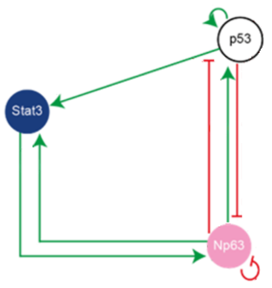
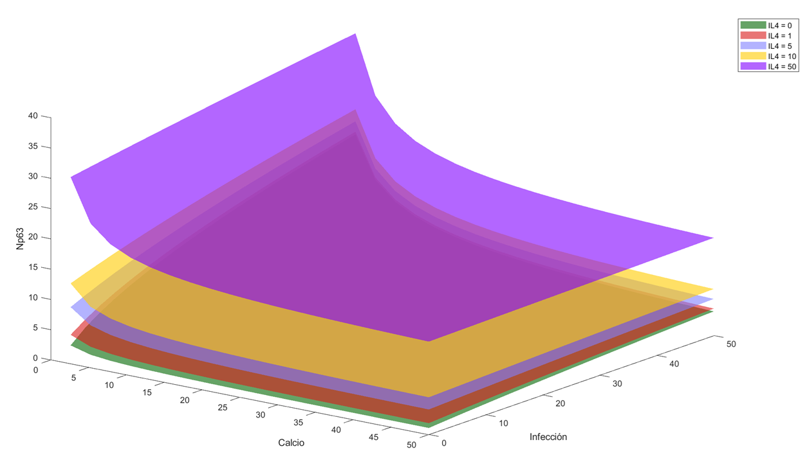
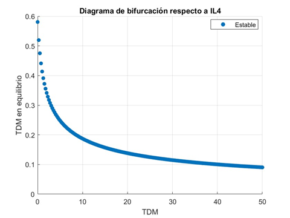

# Modelo Matemático de la Diferenciación de Queratinocitos

Este repositorio contiene el trabajo realizado para el curso **Laboratorio de Modelación II (MAT-283)**, cuyo objetivo fue desarrollar un modelo matemático basado en ecuaciones diferenciales ordinarias (EDOs) no lineales para estudiar la diferenciación de queratinocitos y los factores que afectan la homeostasis de la epidermis.

El modelo fue calibrado con datos experimentales y permite analizar el efecto de variables como:
- **Ca (Calcio)**: Daño a la barrera cutánea.
- **NFkB**: Infección bacteriana.
- **VPH**: Virus del Papiloma Humano.
- **IL4**: Inflamación.

---

## Vista general del modelo

---

## Ejemplo de resultados
**Sábana de salud (p53 vs Ca e Inf):**

**Validación experimental:**

---

## Contenido del repositorio
- **Informe/** → Informe final del proyecto en PDF.  
- **Codigos_MATLAB/** → Scripts en MATLAB.  

---

## Autores
- **Benjamín Acuña** – [GitHub](https://github.com/Bacuna98) – benjamin.acuna@sansano.usm.cl  
- **Gonzalo Ayancán** – gonzalo.ayancan@usm.cl  
- **Nolberto Rivera** – nolberto.rivera@usm.cl  

**Mandante:** Dra. Elisa Domínguez-Hüttinger – Grupo SysBio, UNAM.  
**Profesor guía:** Dr. Pablo Aguirre Olea – UTFSM.

---

## Tecnologías utilizadas
- **MATLAB** para simulaciones y análisis.
- Métodos de optimización local y global para calibración de parámetros.
- Análisis de nulclinas y exploración de superficies ("sábanas de salud").

---

## Licencia
Este proyecto se publica con fines académicos y de difusión del trabajo realizado.  
Los datos experimentales provienen de colaboradores de SysBio y están sujetos a sus términos de uso.

